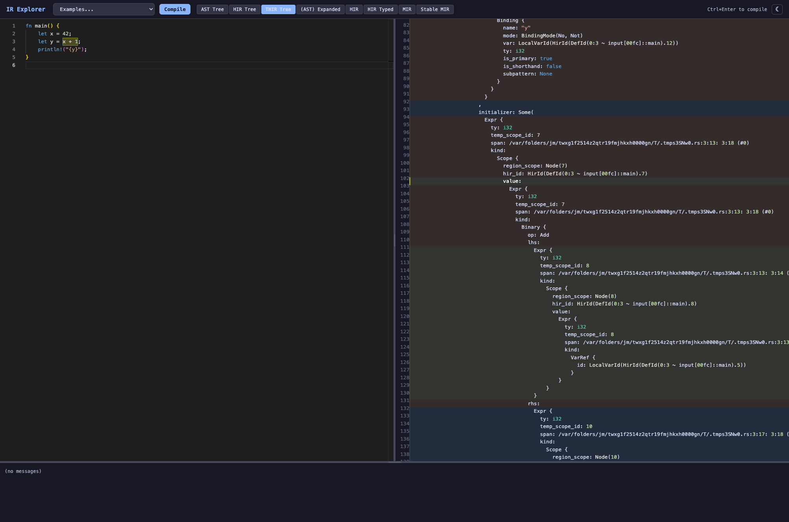

# IR Explorer

A local web tool for exploring Rust compiler intermediate representations.
Write Rust code in a Monaco editor and instantly view its AST, HIR, THIR, MIR,
and other IR forms side by side.




## Features

- **Multiple IR views** — AST Tree, HIR, HIR Typed, THIR Tree, MIR, Stable MIR,
  and expanded AST, all compiled in parallel
- **Source mapping** — hover over IR output lines to highlight the corresponding
  source code in the editor
- **Monaco editor** — full VS Code editing experience with Rust syntax support
- **Dark/light themes** — Catppuccin color scheme with a toggle
- **Built-in examples** — desugaring, moves & drops, borrowing, pattern matching,
  closures
- **Resizable panes** — drag handles between editor, IR output, and messages

## Prerequisites

- [Rust](https://rustup.rs/) (stable toolchain — used to build the app)
- Rust **nightly** toolchain (used at runtime to produce IR output):
  ```sh
  rustup toolchain install nightly
  ```

## Quick Start

```sh
git clone https://github.com/volsa/rust-irexplorer.git
cd rust-irexplorer
make run
```

This builds the server and opens `http://127.0.0.1:3000` in your browser.

> **Note:** The server binds to `127.0.0.1` (localhost only). It is not
> accessible from other machines on the network.

## Usage

1. Write or paste Rust code in the left editor pane
2. Click **Compile** (or press **Ctrl+Enter**)
3. Select an IR type from the toolbar buttons to view its output
4. Hover over IR lines to highlight the corresponding source lines

## Project Structure

```
src/
  main.rs        Axum server, routing, static file serving
  api.rs         POST /api/compile handler
  compiler.rs    Invokes rustup run nightly rustc on a temp file
  ir.rs          IrType enum with allowlist validation
static/
  index.html     Single-page app shell
  app.js         Frontend logic (vanilla JS, Monaco editor)
  style.css      Catppuccin-themed styles
```

## How It Works

1. The frontend sends `POST /api/compile` with `{ source, ir_type }` for each
   selected IR type (requests run in parallel)
2. The Axum handler spawns a blocking task
3. `compiler::compile()` writes the source to a temp file and runs
   `rustup run nightly rustc -Zunpretty=<ir_type>`
4. stdout (IR output) and stderr (diagnostics) are returned as JSON
5. The frontend renders the IR with highlight.js and maps source spans back to
   editor lines

The `ir_type` parameter is validated against a strict allowlist in `ir.rs`,
preventing arbitrary flags from being passed to `rustc`.

## Security Notes

- **Local only** — the server binds to `127.0.0.1` and is not reachable from
  external networks
- **No data leaves your machine** — all compilation happens locally via your
  installed `rustc` nightly toolchain
- **Input validation** — IR types are checked against an allowlist before being
  passed to `rustc`
- **Temp file cleanup** — source files are written to OS temp directories and
  automatically cleaned up

## License

[MIT](LICENSE)
